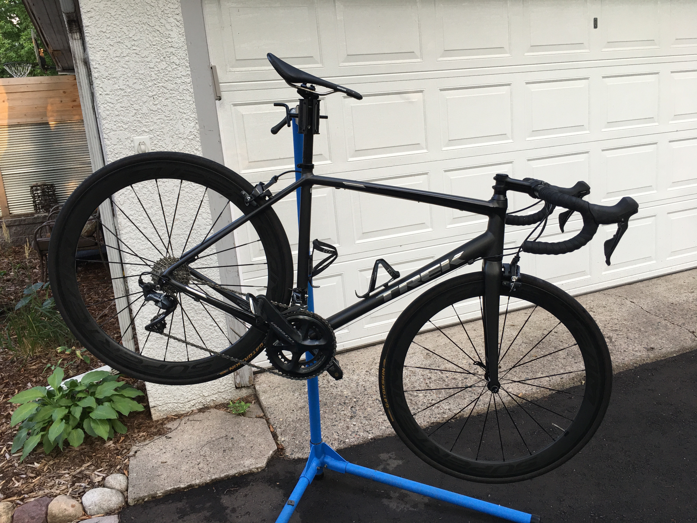

__
## About
_Our name is Q's Bike Repair and Maintenance and we offer bike repair and maintenance services. In addition, We also offer pick up & drop off for a flat fee._

_The pro-level tune up, bike assembly, and the works require the pick up & drop off fee._

## The Team
_Quentin Ikuta is a seasoned mechanic with experience at Chilkoot Cyclery and Now Bikes. When he's not working on customer's bikes, he keeps himself busy working on friend's bikes as well as his own._
__

_Jack Swift is a self-taught and very well versed mechanic. Ask him about anything from mechanics to pro bike racing. Jack is the go to man to complement this full service bicycle repair department._
__

 <a href="https://www.facebook.com/Qs-Bike-Repair-103711121461207/services/?view_public_for=103711121461207&ref=page_internal">See the Facebook Page for details</a>

## Service Offerings
## Pick up and drop off $15
_If you live within 15 miles of me (55104), I will pick up and drop off your bike at an agreed upon time for a fee._

## Ala Carte Services $-$$$
_I offer certain services ala carte. Please get in touch and we will figure out pricing. Here are some examples:_
* Gear indexing $25
* Brake adjustment $20
* Chain install $20
* Flat repair $20 per wheel
* Bar tape install $15
* Wheel truing $20 per wheel
* Severe wheel truing - get in touch
* Basic bike clean $30
* Bike degrease, clean, lube $60

## Parts and Accessories
_Get in touch for price_
_Parts and Accessories needed are not included. Please arrange parts and accessories needed prior to service. If you need help determining what you may need, please get in touch. If you end up needing parts during service, I will reach out to verify that parts are okay to purchase._

## Basic Tune Up Starting at $50
_The basic tune is perfect if your bike has been sitting for a while and needs some love. This service will ensure that your bike is functioning safely and smoothly._
* Frame clean
* Wheel clean
* Drivetrain clean
* Gear indexing
* Brake adjustment and check for wear
* Bolt checking and torquing
* Chain check (for wear/replacement)
* Air in tires

## Pro Tune Up Starting at $85
* Everything from Basic Tune Up
* Drivetrain degrease and lube Soapy bike wash
* Install new chain (if needed)
* Install new handlebar tape (must be arranged prior to service)
* Replace tubes (if needed, must be arranged prior to service)
* True Wheels (if not severely out of true)
* Note: requires pick up & drop off service

## The Works Starting at $175
* Everything from Pro Tune Up
* Install new parts such as crankset, headset, tires, etc.
* Hydro brake bleed + cost of fluid needed (variable)
* Rotor truing Creak or squeak troubleshooting
* Pedal service (clean and lube)
* Note: Requires pick up & drop off service

## Bike Assembly Starting at $85
* Assemble new bike
* Apply grease or fiber grip to appropriate parts
* Torque bolts Headset adjustment
* Hub adjustment
* Wheel truing
* Gear indexing
* Brake alignment
* Pre-stretch cables
* Price increases with hydraulic brakes and additional complexities.

[back](./)
