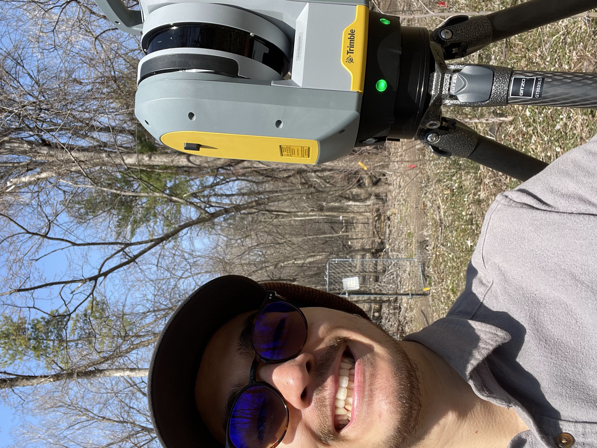
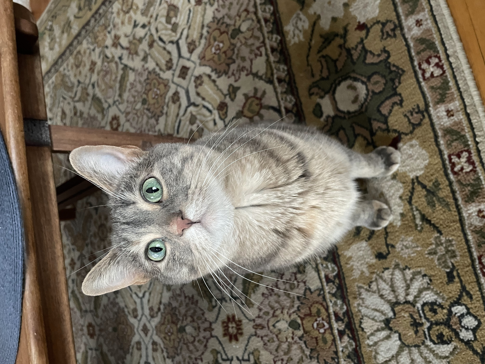
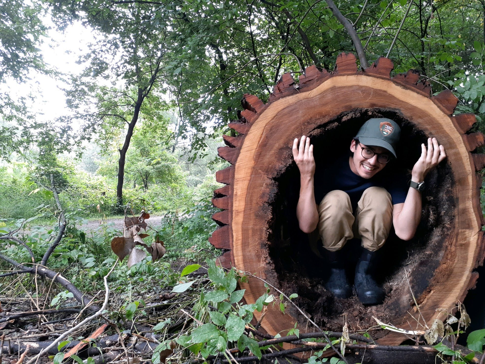
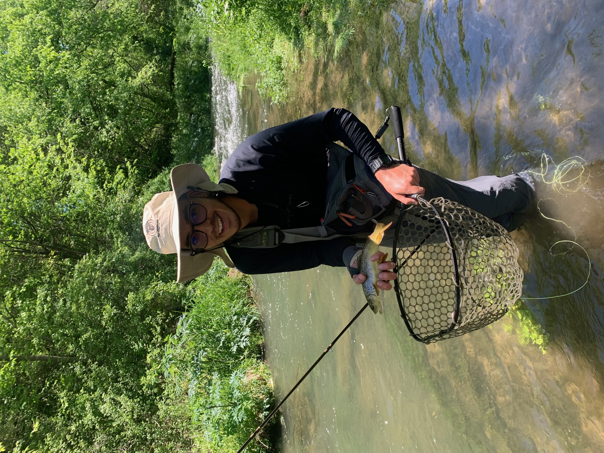

## About Me

_My name is Quentin Ikuta and I am passionate about forestry, geospatial analysis, ecosystem restoration, and traditional ecological knowledge-based practices. I recently graduated with my Masters degree from the University of Minnesota, College of Food, Agriculture, and Natural Sciences (CFANS) within the Department of Forest Resources. I studied within the Forests: Biology, Ecology, Conservation, and Management track. When I'm not working, I enjoy spending time with my cat, reading, bike riding, fishing, hunting, hiking, and foraging._

<table><tr>
<td>  </td>
<td>  </td>
</tr><tr>
<td>  </td>
<td>  </td>
</tr></table>

_From top left: Me with a fancy LiDAR  scanner in a floodplain forest, my cat, me in a trunk of a huge Cottonwood tree, my first brown trout on the fly._

[Go Back Home](./)
