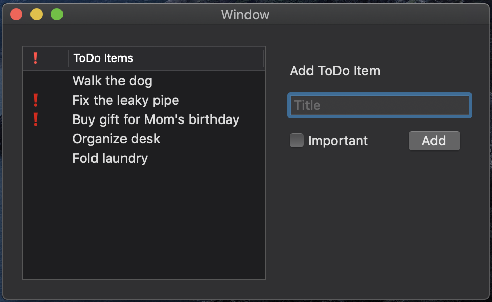

## About Me

_My name is Quentin Ikuta and I am passionate about geospatial analysis, natural resource management, and social justice. I am currently a Masters student at the University of Minnesota, College of Food, Agriculture, and Natural Sciences (CFANS)within the Department of Forest Resources. I am studying within the Geospatial analysis and remote sensing track. When I'm not studying or working, I enjoy spending time with my cat, reading, bike riding, hiking, and prairie frolicking._

<table><tr>
<td>  </td>
<td>  </td>
</tr><tr>
<td>  </td>
</tr></table>

[back](./)
