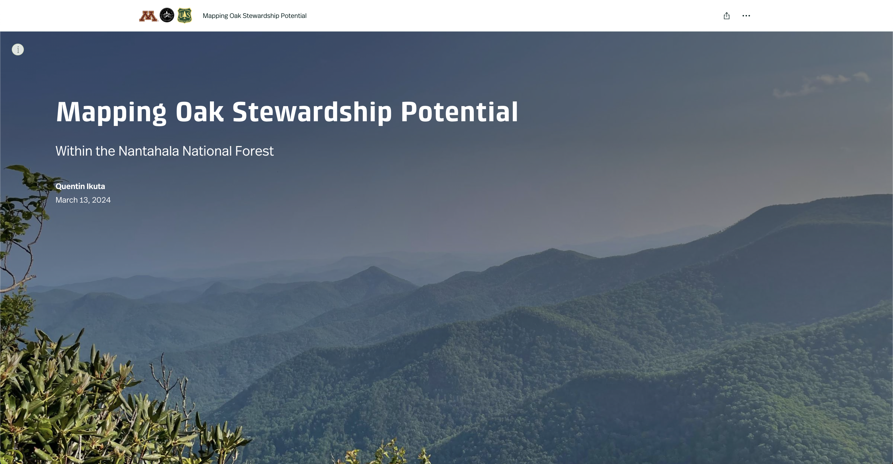
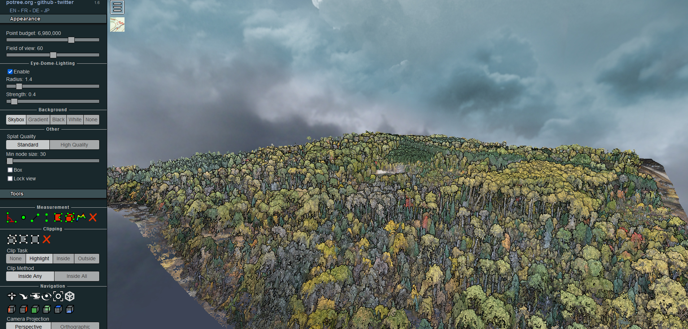
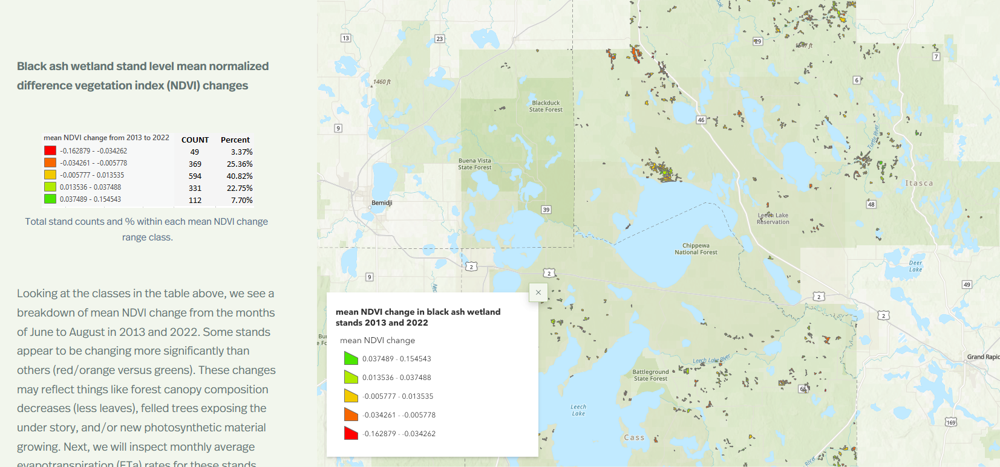

# Projects

## Masters Thesis ArcGIS StoryMap: Mapping Oak Stewardship Potential Within the Nantahala National Forest
__
_Project: My Masters of Science Thesis Summarized in an ArcGIS Online StoryMap. This project aims to spatially map the realized niche of 5 common oak species throughout the Nantahala Mountains within the Nantahala National Forest to inform management order-of-entry and to help prioritize oak-silvicultural systems across the landscape._

<a href="https://arcg.is/1iSvaL1">Click here to view the ArcGIS Online StoryMap</a>

## Photogrammetric Point Cloud Post-Processed with LAStools
__
_Project: Analysis and visualization of a photogrammetrically derived point cloud from a UAS mission in the arrowhead region of Minnesota. See the link below to access the potree viewer._
<a href="./laspublish.6212/portal.html">Potree Viewer</a>

## Black Ash Stand Monitoring on the Chippewa National Forest and Leech Lake Band of Ojibwe lands
__
_Project: A remote sensing project analyzing the health and spatial extent of black ash stands within the Chippewa National Forest and Leech Lake Band of Ojibwe lands._

<a href="https://arcg.is/0T1K0C">Click here to view the ArcGIS Online StoryMap</a>

## Concentrated Animal Feeding Operations (CAFO) Runoff Analysis
__
_Project: Potential Contaminant Runoff Analysis from CAFOs in Martin County, Minnesota_

_Description: This project analyzed the potential runoff from 152 CAFOs in Martin County, MN. This county was chosen after a kernel density analysis was done for all of MN, Martin County had the highest concentration of CAFOs throughout the state. Findings included potential heavy contamination into Elm Creek, a tributary of the Blue Earth river, along with potential moderate contamination in 5 additional creeks/rivers. Additionally, A suitability analysis determined only 17 of 152 total CAFOs to be on suitable land (meaning land with a much lower chance of producing contaminated runoff). Main tools used included **Python** functions for calculating attributes, **HEC-GeoHMS** curve number analysis, and **ArcGIS Pro**. Almost all data for this project was obtained at https://gisdata.mn.gov/._

_Challenges: The main challenge of this project was processing the data. I used various optimization workflows to streamline data proessing and eventually run the necessary geoprocessing without timing out or throwing an error._

[back](./)
