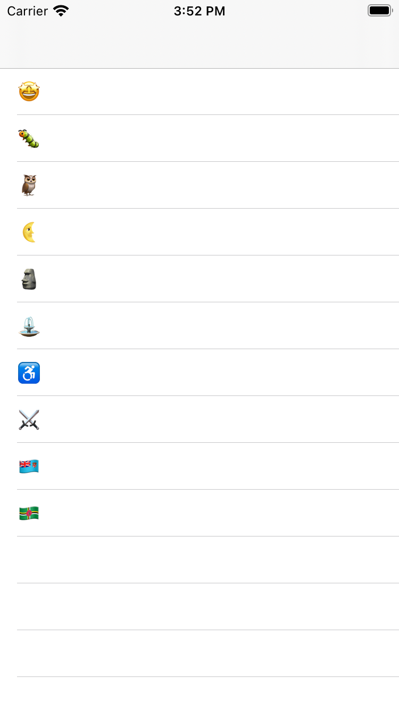

# IOS Projects

## Emoji Dictionary
<table><tr>
<td>  </td>
<td>  </td>
<td>  </td>
</tr></table>
_Project: Emoji Dictionary_

_Description: This project displays emojis in a table view. The user selects an emoji and the screen segues to the definition page for that emoji with an enlarged image and a short text description._

_Challenges: The main challenges of this project were passing around the emoji variables from the list where they originate (the home table view) to the definition page. This challenge was solved by using the "sender" object throughout the functions. Additionally, matching descriptions to each emoji was a challenge but solved using an "emoji" class._

<a href="https://github.com/qikuta/emojidictionary">See the emojidictionary Github repository for code details</a>

# MacOS Projects

## ToDo List
<table><tr>
<td>  </td>
</tr><tr>
<td>  </td>
</tr><tr>
<td>  </td>
</tr></table>
_Project: ToDo List_

_Description: This project presents a window with a table view of tasks, including names and an importance indicator, with ability to add and delete tasks. The delete button only shows up when a task is clicked._

_Challenges: The main challenge of this project was implementing the importance indicator. Since the indicator relies on the "important" box to be checked, logic that interprets the status of that box was included. The solution was to use an "if-else" statement to decide whether or not a task was indicated as important._

<a href="https://github.com/qikuta/ToDoList">See the ToDoList Github repository for code details</a>

## Link It!
<table><tr>
<td>  </td>
<td>  </td>
</tr></table>

_Project: Link It!_

_Description: This project launches a status bar app and presents a window welcoming the user to the app. The app allows a user to convert a copied url into a clickable url that is ready to paste from the clipboard. This application may be used to convert a plain url into a clickable url for sharing, messaging, emailing, or other uses when using/sharing a clickable link is required. As a bonus, this project walked through archiving and sharing the app for distribution and use by others (see the github page for a copy of the app)._

_Challenges: The main challenge of this project was implementing the url conversion. This challenge was solved by understanding how pasteBoards work and creating a solution that returns just the clickable link instead of all the content on the pasteBoard. Additionally, to please both browsers, word documents, and word editors, the url is returned as one item in both "public.html" and "public.utf8-plain-text" formats._

<a href="https://github.com/qikuta/LinkIt">See the ToDoList Github repository for code details</a>

[back](./)
