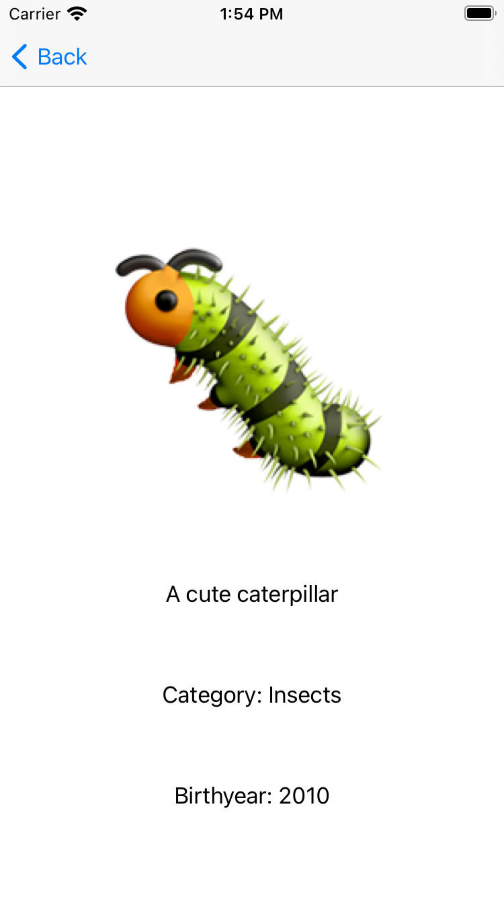

# IOS Projects

## Emoji Dictionary
<table><tr>
<td>  </td>
<td>  </td>
<td>  </td>
</tr></table>
_Project: Emoji Dictionary_

_Description: This project displays emojis in a table view. The user selects an emoji and the screen segues to the definition page for that emoji with an enlarged image and a short text description._

_Challenges: The main challenges of this project were passing around the emoji variables from the list where they originate (the home table view) to the definition page. This challenge was solved by using the "sender" object throughout the functions. Additionally, matching descriptions to each emoji was a challenge but solved using an "emoji" class.

<a href="https://github.com/qikuta/emojidictionary">See the emojidictionary Github repository for code details</a>

[back](./)
